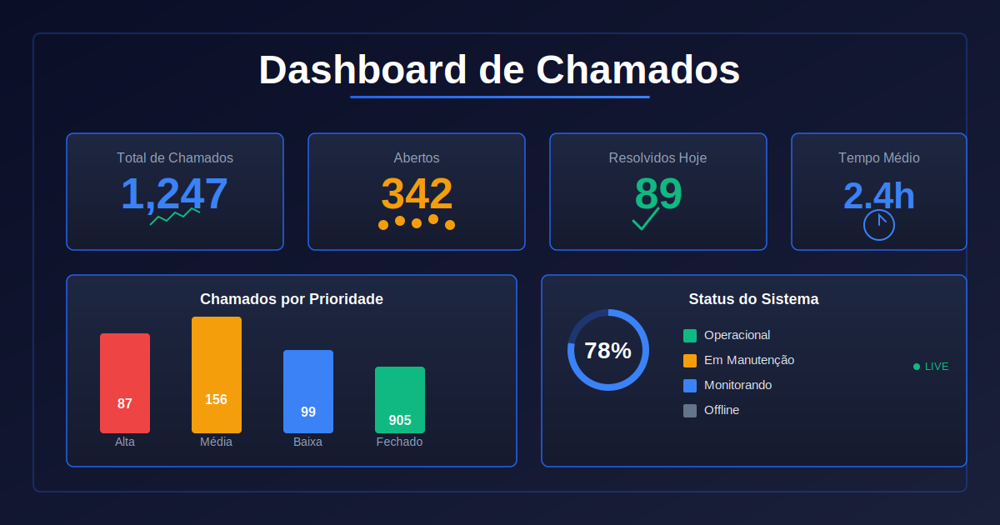

# Apollo Dashboard — Monitoramento de Chamados (NOC)

Este é um dashboard premium desenvolvido para o monitoramento em tempo real de chamados técnicos integrados à API do **Apollo WhatsApp**. O projeto foi otimizado para exibição em centrais de monitoramento (TVs/NOC) e oferece métricas avançadas de produtividade e SLA.



## 🚀 Funcionalidades Principais

- **Visualização em Tempo Real**: Atualização automática dos dados a cada 2 minutos.
- **Otimização para TV (NOC)**: Layout responsivo adaptado para telas grandes com gráficos em largura total.
- **Modo de Apresentação**: Por padrão, o projeto inicia com dados fictícios para demonstrações seguras. O acesso aos dados de produção requer a inserção de um token JWT válido.
- **Gestão de SLA**:
  - Contador de minutos decorridos em tempo real para chamados abertos.
  - Cálculo de duração total para chamados finalizados.
  - Tempo médio de resolução por atendente e geral.
- **Gráficos de Fluxo**: Gráfico de linhas dinâmico que mostra o saldo de chamados pendentes vs. finalizados por hora.
- **Ranking de Produtividade**: Tabela detalhada de desempenho por técnico.

## 🛠 Tecnologias Utilizadas

- **Framework**: [Next.js 14](https://nextjs.org/) (App Router)
- **Linguagem**: TypeScript
- **Estilização**: Tailwind CSS (Tema Dark Premium / Glassmorphism)
- **Componentes**: Radix UI / Shadcn UI
- **Gráficos**: Recharts
- **Ícones**: Lucide React
- **API**: Integração REST com Apollo ERP / WhatsApp

## ⚙️ Configuração e Instalação

### Pré-requisitos
- Node.js 18+ 
- NPM ou Yarn

### Instalação
1. Clone o repositório:
   ```bash
   git clone https://github.com/Sync-Haya/Dashboard-Apollo.git
   ```
2. Instale as dependências:
   ```bash
   npm install
   ```
3. Configure as variáveis de ambiente:
   Crie um arquivo `.env` na raiz do projeto:
   ```env
   APOLLO_API_URL=http://seu-servidor-apollo:9304
   # Opcional: Token fixo para desenvolvimento
   APOLLO_JWT_TOKEN=seu_token_aqui
   ```

### Execução
```bash
npm run dev
```
O dashboard estará disponível em `http://localhost:3000`.

## 🔒 Segurança e Privacidade

- **Dados Sensíveis**: Nenhuma credencial ou token de produção está armazenado no código-fonte.
- **Token JWT**: O acesso aos dados reais é autenticado via JWT, com expiração automática e suporte a renovação via interface.
- **Gitignore**: O projeto já inclui configurações para evitar o envio acidental de arquivos `.env` ou bancos de dados locais.

## 📄 Licença

Este projeto é de uso restrito e privado.

---
Desenvolvido por **Antigravity AI** para **Apollo Suporte**.
